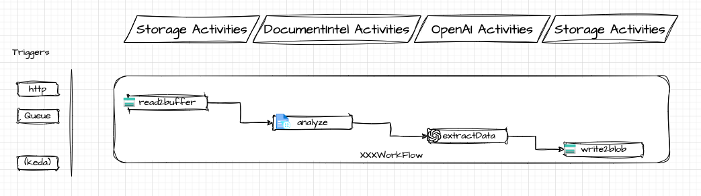

# Implementing Custom Workflows with DurableOrchestrator

## Overview
This guide offers step-by-step instructions for anyone interested in leveraging the DurableOrchestrator framework to develop and implement custom workflows, enhancing their applications with powerful, scalable, and efficient processing capabilities. Leverage Azure Durable Functions' flexibility, scalability, and comprehensive integration capabilities to enhance your applications.

## Prerequisites
- Azure account and subscription
- Basic knowledge of Azure Functions and Durable Functions
- Familiarity with .NET 8.0 and C#

## High Level Flow

In this sample we focus on how to orchestrate and monitor complex workflows, we selected our trigger to be an HTTP request, this is used for simplicity. 
In each workflow, the following components are used:

- The main workflow class, which inherits from `BaseWorkflow` and orchestrates the workflow. There are two main methods in the workflow:
  - `RunOrchestrator`: This method is the entry point for the workflow and is responsible for orchestrating the activities. This is your main workflow logic, it can call other functions, use any of the dependencies injected during the startup. When calling another Activity function, `context.CallActivityAsync` is used. [Educate yourself](https://learn.microsoft.com/en-us/azure/azure-functions/durable/durable-functions-overview?tabs=in-process%2Cnodejs-v3%2Cv1-model&pivots=csharp) on the basic concepts of Azure Durables Functions such as fan-in/fan-out patterns, chaining, and error handling.
  - `HttpStart`: This method is used to trigger the workflow via an HTTP request.
- We included few sample classes to demonstrate how activity functions are created. The main idea is to keep each individual function as simple as possible, stateless and reusable. Use the `BaseActivity` class to ensure consistent telemetry and tracing across all activities.
- Each specific activity function(s) class would also need an extension class, this class is used to instantiate the activity and register it with the dependency injection container. This is important to ensure that the activity function can be injected with any dependencies it needs.

## Project Structure and main components

The solution is composed of several projects, each targeting specific functionalities within the Azure ecosystem, alongside a core project that houses base classes, interfaces, and common utilities required across the solution.

### Projects Overview

- **DurableOrchestrator.Core**: Contains all base classes, interfaces, and observability utilities essential for the solution. Acts as the foundation for extending functionalities in other projects.
- Each of these projects is tailored to integrate specific Azure services, containing extension methods, activity functions, models for inputs/outputs, and service-specific settings classes for DI registration:
  - **DurableOrchestrator.AzureTextAnalytics**
  - **DurableOrchestrator.AzureStorage**
  - **DurableOrchestrator.AzureOpenAI**
  - **DurableOrchestrator.AzureKeyVault**
  - **DurableOrchestrator.AzureDocumentIntelligence**
- **DurableOrchestrator**: The main project that contains the workflow logic orchestrating across the services defined in the other projects.


_A high-level architecture diagram of the DurableOrchestrator solution, a central orchestrator project with multiple service-specific library projects, each dedicated to integrating with different Azure services. The core library provides foundational support across the solution._

## Getting Started

- Follow our [Deployment Guide](./DeploymentGuide.md) to set up your Azure environment and deploy the DurableOrchestrator project.
- Install .NET 8.0 and the Azure Functions Core Tools locally.

### Main Components


## Configuration

The repository contains a ```local.settings.json.template``` file that you can use as a template for your local settings. This file includes placeholders for the required settings.

>Note: Excluding the storage required for Azure Functions, there are no connection strings, secrets, or keys in the settings file. Use **identity-based access** and managed identities for secure access to Azure services.

**Cloud Deployment**: Our IaC scripts would create the necessary resources with hosting solution on Azure Container Apps.

## Workflow Development - Creating a workflow from existing components

**Use Case**: Your company receives invoices, it needs to save the information documented in these invoices and also confirm the receipt of the invoice, this is done by confirming both distributer (delivery guy) and the receiver signed the document. Your researched identified the pre-built layout model as a good fit to extract all text from the invoice, you also tested that given the text to a GPT model would enable the proper data extraction and formatting. The number of daily invoices is unknown, there are days with dozens of invoices and days with hundreds of invoices.

### Designing the Workflow

- The workflow would be a standard all-in-one workflow (no fan-out/fan-in pattern).
- Invoices would be dropped to blob storage and specific queue message would be created for each invoice.
- The workflow would be triggered by a queue message.
- The following steps would be executed to facilitate the business need:
  - Create a SAS token for the invoice blob, using Storage Activities.
  - Use Azure DI to extract all text from the invoice, using Text Analytics Activities into a markdown content.
  - Use the output markdown as the input for a GPT model, using OpenAI Activities to generate a formatted json.
  - Save the formatted json to blob storage, using Storage Activities.



In order to use the required activities, we should register them in the DI container. The `Program.cs` file in the `DurableOrchestrator` project is where the DI container is configured. You can refer to the existing extensions and activities classes for guidance on how to create and register new activities.

```csharp
services.AddBlobStorage(builder.Configuration);
services.AddDocumentIntelligence(builder.Configuration);
services.AddOpenAI(builder.Configuration);
```

## Consider revisit of this sections->

## Defining Your Workflow

### Enhancing an Existing Workflow

Lets revisit an existing workflow, `TextAnalyticsWorkflow`, and enhance it with additional activities. As of now the workflow receives a list of product feedback as part of the payload. It calls the `TextAnalyticsActivities` to perform sentiment analysis on the feedback. The call uses a fan-out/fan-in pattern to process the feedback in parallel. Upon sentiment completion the workflows saves the results to a `json` file.

The new requirement is to create an action plan for the product feedback. You should use Azure OpenAI chat completion to generate a markdown file with an action plan. Here is a sample prompt: ```you are a product owner, you get a list of product feedback and the calculated sentiment. and you create an action plan to address the main issues. you respond in a markdown file that has the original product feedback, divided to categories, the next section you suggest to address the feedback.```

Lets review the missing components in the workflow:
- First, we would need an Azure OpenAI chat completion end-point to call.
- We would need to assign proper role to the DurableOrchestrator allowing it to make calls to the OpenAI end-point.
- A new environment variable to store the OpenAI end-point.
- Now we would need to define the extension, and ensure its instantiated and registered with the dependency injection container. You can refer to the `TextAnalyticsExtensions` class for an example, it create the `TextAnalyticClient` that is then used in the activity class. In our case we would need to create a new extension class, `OpenAIExtensions` that would create the `OpenAIClient` and enable registration it with the dependency injection container. (In `Program.cs`)
- Now after we have the extension class, its time to create the activity class, `OpenAIActivities`. This class when instantiated would be injected with the `OpenAIClient` and the next thing is to create the method that would use the prompt together with the previous step output (it is a `json` file with the list of product feedback and the calculated sentiment) and call the OpenAI end-point. The result would be a markdown file with the action plan.
- The next step is to write this content to blob.

### Creating a New Workflow

Before you start, you should have a clear understanding of the workflow you want to implement. You should also have a list of activities that the workflow will perform. Address missing Activities and Extensions as they are needed. Follow similar steps in the existing workflow classes. The naming convention is important for the monitoring to be able and pick up your new workflow and activities.

The development can be done either locally or using GitHub code-spaces.

## Contributing
We welcome contributions from the community. Please submit pull requests or issues to our GitHub repository to help improve the `DurableOrchestrator` project. We are mainly interested in adding new activities.

