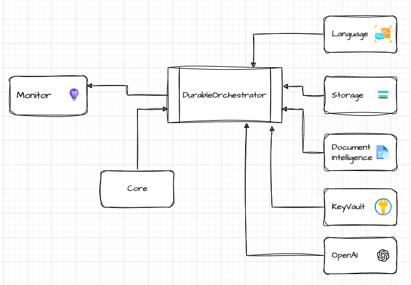

# Implementing Custom Workflows with DurableOrchestrator

## Overview
This guide offers step-by-step instructions for anyone interested in leveraging the DurableOrchestrator framework to develop and implement custom workflows, enhancing their applications with powerful, scalable, and efficient processing capabilities. Leverage Azure Durable Functions' flexibility, scalability, and comprehensive integration capabilities to enhance your applications.

## Prerequisites
- Azure account and subscription
- Basic knowledge of Azure Functions and Durable Functions
- Familiarity with .NET 8.0 and C#

## High Level Flow

In this sample we focus on how to orchestrate and monitor complex workflows, we selected our trigger to be an HTTP request, this is used for simplicity. 
In each workflow, the following components are used:

- The main workflow class, which inherits from `BaseWorkflow` and orchestrates the workflow. There are two main methods in the workflow:
  - `RunOrchestrator`: This method is the entry point for the workflow and is responsible for orchestrating the activities. This is your main workflow logic, it can call other functions, use any of the dependencies injected during the startup. When calling another Activity function, `context.CallActivityAsync` is used. [Educate yourself](https://learn.microsoft.com/en-us/azure/azure-functions/durable/durable-functions-overview?tabs=in-process%2Cnodejs-v3%2Cv1-model&pivots=csharp) on the basic concepts of Azure Durables Functions such as fan-in/fan-out patterns, chaining, and error handling.
  - `HttpStart`: This method is used to trigger the workflow via an HTTP request.
- We included few sample classes to demonstrate how activity functions are created. The main idea is to keep each individual function as simple as possible, stateless and reusable. Use the `BaseActivity` class to ensure consistent telemetry and tracing across all activities.
- Each specific activity function(s) class would also need an extension class, this class is used to instantiate the activity and register it with the dependency injection container. This is important to ensure that the activity function can be injected with any dependencies it needs.

## Project Structure and main components

The solution is composed of several projects, each targeting specific functionalities within the Azure ecosystem, alongside a core project that houses base classes, interfaces, and common utilities required across the solution.

### Projects Overview

- **DurableOrchestrator.Core**: Contains all base classes, interfaces, and observability utilities essential for the solution. Acts as the foundation for extending functionalities in other projects.
- Each of these projects is tailored to integrate specific Azure services, containing extension methods, activity functions, models for inputs/outputs, and service-specific settings classes for DI registration:
  - **DurableOrchestrator.AzureTextAnalytics**
  - **DurableOrchestrator.AzureStorage**
  - **DurableOrchestrator.AzureOpenAI**
  - **DurableOrchestrator.AzureKeyVault**
  - **DurableOrchestrator.AzureDocumentIntelligence**
- **DurableOrchestrator**: The main project that contains the workflow logic orchestrating across the services defined in the other projects.


_A high-level architecture diagram of the DurableOrchestrator solution, a central orchestrator project with multiple service-specific library projects, each dedicated to integrating with different Azure services. The core library provides foundational support across the solution._

## Getting Started

- Follow our [Deployment Guide](./DeploymentGuide.md) to set up your Azure environment and deploy the DurableOrchestrator project.
- Install .NET 8.0 and the Azure Functions Core Tools locally.

### Main Components


## Configuration

The repository contains a ```local.settings.json.template``` file that you can use as a template for your local settings. This file includes placeholders for the required settings.

>Note: Excluding the storage required for Azure Functions, there are no connection strings, secrets, or keys in the settings file. Use **identity-based access** and managed identities for secure access to Azure services.

**Cloud Deployment**: Our IaC scripts would create the necessary resources with hosting solution on Azure Container Apps.

## Workflow Development - Learn by Example

We created an [example](./Examples/Invoices/Invoices.md) to guide you through the process of developing a data processing pipeline using the DurableOrchestrator solution. The example focuses on ingesting various invoice formats, utilizing Document Intelligence to extract text, transforming the data to JSON, ensuring a consistent output structure, error handling, and validation.


