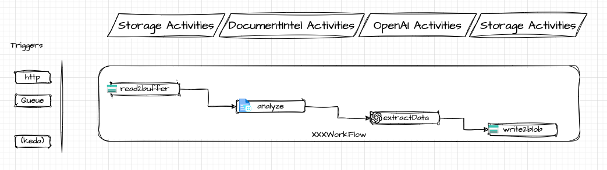

# Invoice Data Processing Pipeline Use Case

## Context

In many companies, invoices are received through various channels including email, fax, and messaging platforms such as WhatsApp. These invoices often originate from multiple providers and come in different formats and structures. The challenge is to create a data processing pipeline capable of ingesting these diverse invoice types and converting them into a unified invoice structure for further processing and analysis.

## Solution Overview

The proposed solution leverages the capabilities of Document Intelligence, specifically utilizing its pre-built layout model to extract text from documents. This model is adept at interpreting various document layouts and converting them into a structured markdown format.

### Process Flow

1. **Document Ingestion**: The pipeline begins by ingesting the invoice documents received through different channels.
   
2. **Text Extraction**: Utilizing Document Intelligence, the text is extracted from these documents and transformed into markdown representation.

3. **Data Transformation**:
    - The markdown representation is then fed into a large language model.
    - The model is instructed to analyze the text and return a JSON representation of the desired invoice structure.

### Language Models

Both GPT-4 and GPT-3.5 Turbo are proficient in extracting information from text and structuring it into JSON objects. To guide the model effectively, it is essential to provide a clear JSON structure within the prompt. This will instruct the model on the expected format and facilitate accurate data extraction.

## Assignment

Develop a data processing pipeline using the `DurableOrchestrator` solution's existing extensions and activity functions. Your pipeline should adhere to the following requirements:

- **Ingest Various Invoice Formats**: Incorporate logic to handle invoices received via email, fax, WhatsApp, and other channels, accommodating different formats and structures. For your first step focus on single ingestion source such as blob storage.
- **Utilize Document Intelligence**: Leverage the `DurableOrchestrator.AzureDocumentIntelligence` extension to extract text and convert it into markdown.
- **Transform to JSON**: Employ the `DurableOrchestrator.AzureOpenAI` activity function to instruct a large language model to parse the markdown and output a structured JSON representation of the invoice data.
- **Consistent Output Structure**: Ensure the JSON output conforms to a predefined schema that represents a unified invoice structure.
- **Error Handling**: Implement robust error handling within the workflow to manage exceptions and discrepancies in invoice formats.
- **Validation**: Include validation checks to ensure the integrity and accuracy of the data extracted and transformed by the model.

### Expectations

- Integrate and build upon the provided `DurableOrchestrator` extensions and activities.
- Create a workflow within the `DurableOrchestrator` project that orchestrates the end-to-end process.
- Provide a documentation section detailing the interaction between the workflow, extensions, and activities, and explain how data flows through the pipeline.
- Think of scale, how would you handle a large number of invoices? What optimizations would you make to ensure efficient processing?

### Deliverables

Submit the following as part of your assignment:

- A fully implemented data processing pipeline within the `DurableOrchestrator` solution.
- Source code files and any necessary configuration changes.
- Test cases, including sample invoice inputs and the expected JSON outputs after processing.

